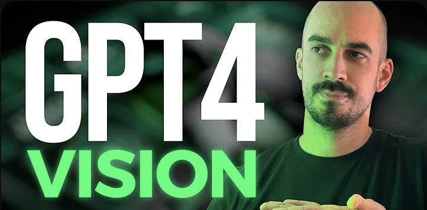
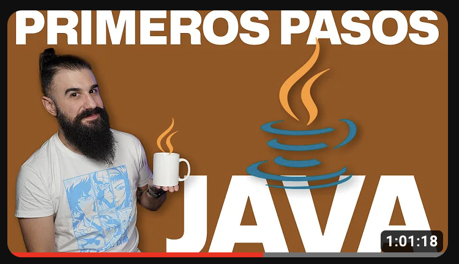
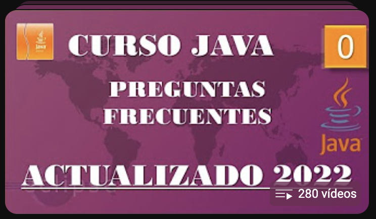

# learn-java
Repositorio para aprender Java

## Instalación de Java
- [Descargar Java](https://www.java.com/es/download/ie_manual.jsp)
- [Descargar JDK 21 Windows](https://download.oracle.com/java/21/latest/jdk-21_windows-x64_bin.msi)
- [Más versiones del JDK](https://www.oracle.com/java/technologies/downloads)
- [VS Code](https://code.visualstudio.com/download)

- [Java en W3schools](https://www.w3schools.com/java/default.asp)

## Vídeos Recomendados
### ¡La VISIÓN ya ha llegado a ChatGPT!

### Introducción a Java de una hora by Brais Moure

### Curso de Java desde 0 - by pildorasinformaticas en YT
**Nota:** aunque sea una lista actualizada al año pasado, sigue siendo válido en gran medida *quitando la parte de applets que ya no se usan*.
280 vídeos cortos sobre Java en lista de reproducción:

